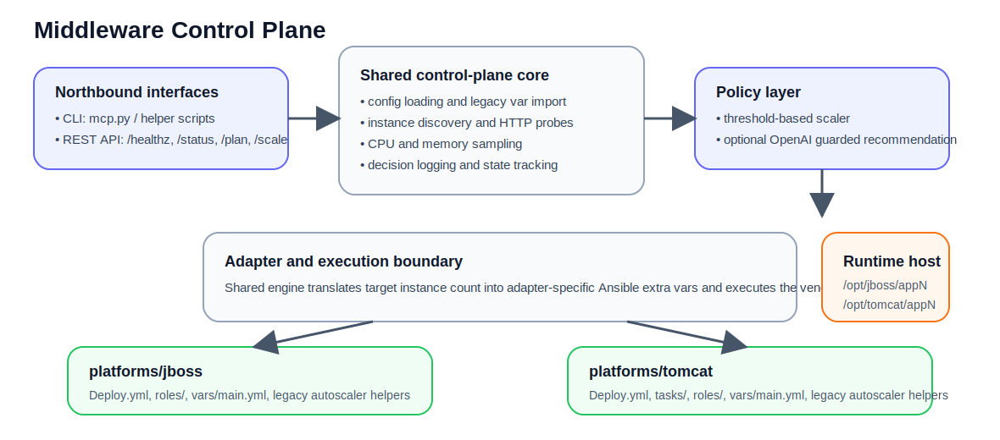

<<<<<<< HEAD
# MiddlewareControlPlane
Middleware Control Plane
=======
# Middleware Control Plane

A shared Python control plane for **JBoss EAP** and **Tomcat** that keeps platform-specific Ansible execution where it belongs while centralizing discovery, health checks, scaling policy, API exposure, and evidence generation.



## Why this repository exists

The original JBoss and Tomcat autoscaler projects solved the same class of problem twice: discover running instances, observe health and load, decide whether to scale, and then call a platform-specific playbook.

This monorepo extracts the common control-plane responsibilities into one root project and keeps the middleware-specific playbooks under:

- `platforms/jboss`
- `platforms/tomcat`

That gives you one operator-facing entrypoint with two execution backends.

## What is shared vs. platform-specific

| Layer | Shared in repo root | Remains platform-specific |
|---|---|---|
| Control loop | yes | no |
| Health probing | yes | no |
| CPU / memory sampling | yes | no |
| Rule-based policy | yes | no |
| Optional OpenAI recommendation | yes | no |
| Ansible playbook execution | no | yes |
| Runtime file rendering | no | yes |
| Middleware startup / shutdown tasks | no | yes |

## Repository layout

```text
middleware-control-plane/
├── benchmarks/                 # load generator and report writer
├── configs/                    # root control-plane configs
├── docs/                       # architecture and operator docs
├── examples/                   # example artifacts
├── middleware_control_plane/   # shared engine, API, policy, adapters
├── platforms/
│   ├── jboss/                  # vendored JBoss execution backend
│   └── tomcat/                 # vendored Tomcat execution backend
├── scripts/                    # convenience entrypoints and validation
├── systemd/                    # sample service unit
├── Makefile
└── mcp.py                      # main CLI entrypoint
```

## Preferred entrypoints

Use the root entrypoints rather than the vendored legacy autoscaler scripts.

```bash
python mcp.py --config configs/jboss-local.yaml --once --dry-run
python mcp.py --config configs/tomcat-local.yaml --once --dry-run
./scripts/run_api.sh
```

Helper shortcuts are also included:

```bash
./scripts/run_jboss_once.sh --dry-run
./scripts/run_tomcat_once.sh --dry-run
./scripts/run_jboss_loop.sh
./scripts/run_tomcat_loop.sh
./scripts/validate_repo.sh
```

## Quick start

### 1. Create a virtual environment

```bash
python3 -m venv .venv
. .venv/bin/activate
pip install -r requirements.txt
```

### 2. Validate the repository

```bash
./scripts/validate_repo.sh
```

### 3. Run a single dry-run cycle

```bash
python mcp.py --config configs/jboss-local.yaml --once --dry-run
python mcp.py --config configs/tomcat-local.yaml --once --dry-run
```

### 4. Run the API

```bash
./scripts/run_api.sh
```

Then query it:

```bash
curl 'http://127.0.0.1:11000/status?config_path=configs/jboss-local.yaml'
```

## Configuration model

There are two configuration layers:

1. **Root control-plane config** in `configs/*.yaml`
   - loop interval
   - thresholds and cooldowns
   - state and decision-log paths
   - API and LLM behavior
   - Ansible execution path

2. **Vendored platform vars** in `platforms/*/vars/main.yml`
   - instance-root conventions
   - middleware runtime defaults
   - per-platform autoscale defaults

The root config can import missing values from the vendored vars file through `legacy_vars_file`.

Example:

```yaml
platform: jboss
legacy_vars_file: ../platforms/jboss/vars/main.yml
```

## Execution flow

1. Load root config and merge legacy platform defaults.
2. Discover runtime instances from the configured instance root.
3. Probe each instance over HTTP.
4. Sample host CPU and memory.
5. Produce a scale decision from rules or guarded OpenAI output.
6. Translate target count into adapter-specific Ansible extra vars.
7. Execute the vendored playbook, or emit the dry-run command.
8. Append the decision log and persist state.

## Platform notes

### JBoss

- adapter: `middleware_control_plane/adapters/jboss.py`
- backend: `platforms/jboss`
- default config: `configs/jboss-local.yaml`

### Tomcat

- adapter: `middleware_control_plane/adapters/tomcat.py`
- backend: `platforms/tomcat`
- default config: `configs/tomcat-local.yaml`
- `legacy_platform_key` is set to `tomcat_defaults` to match the vendored vars schema

## REST API

Available endpoints:

- `GET /healthz`
- `GET /status`
- `POST /plan`
- `POST /scale`
- `POST /config/resolved`

Example planning request:

```bash
curl -X POST 'http://127.0.0.1:11000/plan' \
  -H 'Content-Type: application/json' \
  -d '{"config_path":"configs/tomcat-local.yaml","dry_run":true}'
```

## Benchmark and evidence output

The repository includes a simple load generator:

```bash
python benchmarks/run_benchmark.py \
  --url http://127.0.0.1:8080/ \
  --concurrency 20 \
  --requests 500 \
  --output-dir docs/evidence
```

Generated benchmark artifacts belong under `docs/evidence/`, which is prepared for output but git-ignored at the file level.

## OpenAI integration

Set credentials and enable the LLM policy block in a config:

```bash
export OPENAI_API_KEY=YOUR_KEY
export OPENAI_MODEL=gpt-4.1-mini
```

```yaml
llm:
  enabled: true
  model: gpt-4.1-mini
```

Guardrails clamp recommendations to configured bounds, limit step size, and block unsafe scale-down decisions during unhealthy periods or cooldown windows.

## Included cleanup in this package

This package has already been normalized for a cleaner GitHub handoff:

- repo-local state paths instead of transient system paths
- top-level architecture diagram
- generated evidence artifacts removed from versioned docs
- validation and loop helper scripts added
- `Makefile` added for common commands
- root README rewritten around the monorepo operating model

## Important limitations

This is a practical starter control plane, not a production-certified orchestrator. Current assumptions include:

- one host per control-loop execution
- local probing against `127.0.0.1`
- local CPU and memory collection from the host
- Ansible as the authoritative reconciler for instance creation and teardown

## Additional docs

- `INTEGRATION_NOTES.md`
- `docs/PLATFORMS.md`
- `docs/evidence/README.md`
>>>>>>> 61db78b (Initial import of MiddlewareControlPlane)
