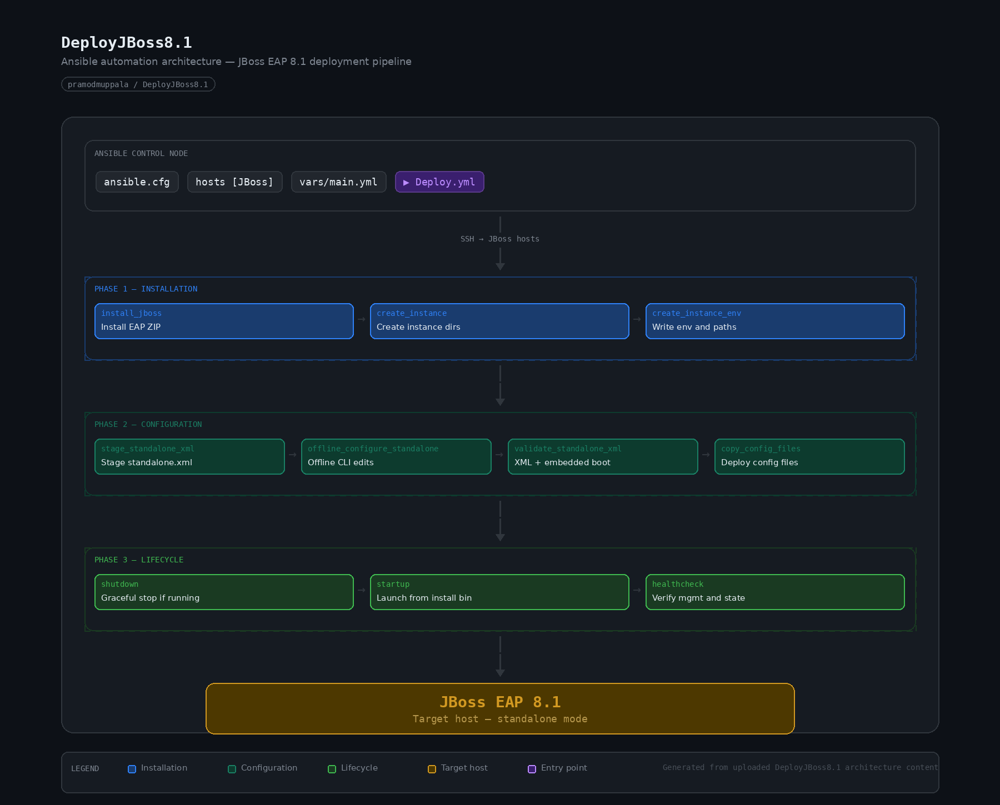

# DeployJBoss8.1

Ansible automation for installing and configuring a **JBoss EAP 8.1** standalone server with a clean split between the **product installation** and the **runtime instance**.

This repository uses an archive-based install, creates an instance under a separate base directory, stages and updates `standalone.xml`, validates the staged configuration with the embedded JBoss CLI, deploys the final config, and then restarts and health-checks the server.

## Architecture




## What this project does

- Installs JBoss EAP from a ZIP archive
- Separates the **install home** from the **instance home**
- Creates the instance directory structure under a dedicated base directory
- Stages `standalone.xml` before modifying it
- Applies offline CLI changes to a validation config
- Validates the staged XML with `xmllint` and embedded `jboss-cli.sh`
- Backs up and deploys the runtime environment file and `standalone.xml`
- Shuts down an existing instance only when it is running
- Starts the server from the **install** binaries while targeting the **instance** base directory
- Waits for the management interface and checks the server state

## Current playbook flow

The main playbook is `Deploy.yml` and runs these roles in order:

1. `install_jboss`
2. `create_instance`
3. `create_instance_env`
4. `stage_standalone_xml`
5. `offline_configure_standalone`
6. `validate_standalone_xml`
7. `copy_config_files`
8. `shutdown`
9. `startup`
10. `healthcheck`

## Repository layout

```text
DeployJBoss8.1/
├── Deploy.yml
├── ansible.cfg
├── hosts
├── docs/
│   └── images/
│       ├── DeployJBoss8.1-architecture.png
│       └── DeployJBoss8.1-architecture.html
├── vars/
│   └── main.yml
└── roles/
    ├── install_jboss/
    ├── create_instance/
    ├── create_instance_env/
    ├── stage_standalone_xml/
    ├── offline_configure_standalone/
    ├── validate_standalone_xml/
    ├── copy_config_files/
    ├── shutdown/
    ├── startup/
    └── healthcheck/
```

## Instance / install separation

This project is designed around two distinct paths:

- **Install home**: immutable JBoss EAP product binaries
- **Instance home**: mutable runtime content for a specific server instance

Default values from `vars/main.yml`:

```yaml
jboss:
  install_home: /opt/products/jboss
  install_product_version: jboss-eap-8.1
  instance_home: /opt/jboss
```

With those defaults, the effective product home becomes:

```text
/opt/products/jboss/jboss-eap-8.1
```

and the instance runtime lives under:

```text
/opt/jboss
```

The instance directory contains:

```text
/opt/jboss/
├── bin/
├── configuration/
├── data/
├── deployments/
├── log/
└── tmp/
```

## Prerequisites

Before running the playbook, make sure the target system has:

- Ansible installed
- JBoss EAP 8.1 ZIP archive available
- Java installed and `jboss.java_home` set correctly
- `xmllint` available for XML validation
- Sufficient privileges for the configured `become_user`

## JBoss installer ZIP

This repository does **not** include the JBoss EAP ZIP archive.

By default, the install role uses:

```yaml
jboss:
  install_zip: jboss-eap-8.1.zip
  install_zip_name: jboss-eap-8.1.zip
```

That means you should either:

- place `jboss-eap-8.1.zip` under `roles/install_jboss/files/`, or
- change `jboss.install_zip` to a controller-side path that Ansible can read

The install role copies the archive to `/tmp` on the target and extracts it under `{{ jboss.install_home }}`.

## Configuration

Edit `vars/main.yml` before your first run.

Key variables:

```yaml
jboss:
  install_home: /opt/products/jboss
  instance_home: /opt/jboss
  install_product_version: jboss-eap-8.1
  java_home: /opt/products/jdk/jdk25

  standalone:
    config_file: standalone.xml
    validation_config_file: standalone-ansible-validate.xml
    bind_address: 0.0.0.0
    management_bind_address: 127.0.0.1

  management:
    host: 127.0.0.1
    port: 9990

staging_dir: /opt/temp/config_build/jboss-eap
instance_env_file: "{{ jboss.instance_home }}/bin/jboss-instance.env"
startup_log: "{{ jboss.instance_home }}/log/startup-ansible.log"
```

## How configuration is staged and validated

This project does **not** modify the live config in place first.

Instead, it follows this pattern:

1. Create the staging directory
2. Seed `standalone.xml` from the instance config if it exists
3. Otherwise seed it from the product default config
4. Copy required realm property files into the instance configuration directory if missing
5. Apply offline CLI updates to a validation copy of `standalone.xml`
6. Validate the staged XML with:
   - `xmllint`
   - embedded `jboss-cli.sh`
7. Copy the validated result into the live instance configuration directory

## Inventory and execution model

The current playbook is written for a local execution model:

```yaml
- name: Deploy JBoss EAP
  hosts: JBoss
  connection: local
  become: yes
  become_user: parallels
```

The current sample `hosts` file contains:

```ini
[JBoss]
locahost ansible_connection=local
```

Update that inventory entry for your environment before running the playbook.

## Run the playbook

```bash
ansible-playbook -i hosts Deploy.yml
```

## Startup and shutdown behavior

This repository starts and stops JBoss EAP from the **install** binaries, not from the instance directory.

That means the playbook uses binaries such as:

```text
{{ jboss.install_home }}/{{ jboss.install_product_version }}/bin/standalone.sh
{{ jboss.install_home }}/{{ jboss.install_product_version }}/bin/jboss-cli.sh
```

and points them at the instance with:

```text
-Djboss.server.base.dir={{ jboss.instance_home }}
```

Shutdown behavior is guarded:

- first check whether a JBoss process is running
- then check whether the management port is reachable
- only then call `jboss-cli.sh --command="shutdown"`

## Logs and troubleshooting

Useful paths:

```text
{{ jboss.instance_home }}/log/server.log
{{ jboss.instance_home }}/log/startup-ansible.log
```

If startup succeeds but the management port does not come up:

- verify the management bind address and port in `standalone.xml`
- verify required realm property files exist under `{{ jboss.instance_home }}/configuration`
- inspect `server.log` for boot failures

## Notes

- Keep the JBoss EAP ZIP archive out of Git history unless you explicitly use Git LFS.
- Add architecture images under `docs/images/` so the README renders correctly on GitHub.