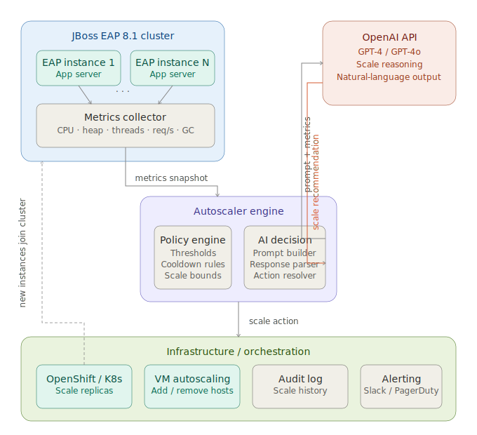

# JBoss EAP 8.1 Autoscaler + OpenAI

This repository is a starter implementation that combines:

- the archive-based, standalone-instance JBoss EAP 8.1 deployment pattern
- automatic scale-up / scale-down logic for multiple instances on one host
- an optional OpenAI policy layer that can recommend scaling actions with guardrails

The implementation is designed around a shared product installation and multiple per-instance runtime directories.

## Architecture



The diagram below shows the control flow between the autoscaler, OpenAI policy layer, Ansible provisioning workflow, and the JBoss EAP instances.

## What this repo does

- installs JBoss EAP 8.1 from a ZIP archive
- keeps the product installation separate from runtime instance directories
- discovers existing instance directories under a common root
- computes a desired target instance set from `jboss.instance_count`
- creates only missing instances
- starts missing or stopped instances
- optionally removes extra instances when scaling down
- probes HTTP endpoints to estimate latency and health
- uses rule-based scaling or OpenAI-backed structured recommendations
- applies safety guardrails before any LLM recommendation can change capacity

## Repository layout

```text
JBossEAP81-Autoscaler-OpenAI/
├── Deploy.yml
├── README.md
├── ansible.cfg
├── hosts
├── jboss_autoscaler.py
├── llm_policy.py
├── requirements.txt
├── systemd/
│   └── jboss-autoscaler.service
├── vars/
│   └── main.yml
└── roles/
    ├── install_jboss/
    ├── discover_instances/
    ├── compute_scale_plan/
    ├── create_instances/
    ├── render_instance_env/
    ├── render_instance_config/
    ├── start_instances/
    ├── remove_extra_instances/
    └── summary/
```

## Runtime model

Example with three instances:

```text
/opt/products/jboss/jboss-eap-8.1      # shared product home
/opt/jboss/app1                         # instance base dir
/opt/jboss/app2
/opt/jboss/app3
```

Each instance gets its own:

- `bin/jboss-instance.env`
- `configuration/standalone.xml`
- `data/`
- `deployments/`
- `log/`
- `tmp/`

## Scaling behavior

The Ansible playbook follows this pattern:

1. install the shared JBoss product if it is missing
2. discover instance directories under `jboss.instance_root`
3. compute the desired instance names from `jboss.instance_count`
4. create missing instances only
5. seed each new instance from the product `standalone.xml`
6. apply per-instance port changes with offline `jboss-cli.sh`
7. start desired instances that are not already running
8. remove extra instances only when `jboss.destroy_enabled=true`

If `app1` already exists and you request `instance_count=3`, the playbook creates only:

- `app2`
- `app3`

It leaves `app1` intact.

If you reduce the requested count and set `destroy_enabled=true`, extra instances are stopped and removed.

## Port model

Port offsets are calculated with a stride. By default:

- base HTTP port: `8080`
- base HTTPS port: `8443`
- base management port: `9990`
- base AJP port: `8009`
- stride: `100`

Example:

- `app1` -> 8080 / 8443 / 9990 / 8009
- `app2` -> 8180 / 8543 / 10090 / 8109
- `app3` -> 8280 / 8643 / 10190 / 8209

## Prerequisites

- Linux host
- Ansible installed
- JBoss EAP 8.1 ZIP archive available to the Ansible controller
- Java installed
- permissions to create directories under the configured install and instance roots
- a usable service account and group, such as `jboss`

## Basic configuration

Edit `vars/main.yml` first.

Important values:

```yaml
jboss:
  install_home: /opt/products/jboss
  install_product_version: jboss-eap-8.1
  install_zip: jboss-eap-8.1.zip
  instance_root: /opt/jboss
  instance_count: 1
  destroy_enabled: false
  java_home: /opt/products/jdk/jdk25
  instance_name_prefix: app
  port_stride: 100
  base_http_port: 8080
  base_management_port: 9990
  health_path: /
```

## Manual scale examples

Scale up to 3 instances:

```bash
ansible-playbook -i hosts Deploy.yml -e '{"jboss":{"instance_count":3}}'
```

Scale down to 1 instance and delete extras:

```bash
ansible-playbook -i hosts Deploy.yml -e '{"jboss":{"instance_count":1,"destroy_enabled":true}}'
```

## Autoscaler usage

Rule-based single run:

```bash
python3 jboss_autoscaler.py --once
```

Rule-based continuous loop:

```bash
python3 jboss_autoscaler.py
```

OpenAI-backed policy:

```bash
export OPENAI_API_KEY=YOUR_KEY
export OPENAI_MODEL=gpt-4o-2024-08-06
python3 jboss_autoscaler.py --use-llm --once
```

Example with tighter capacity bounds:

```bash
python3 jboss_autoscaler.py \
  --use-llm \
  --min-instances 2 \
  --max-instances 6 \
  --once
```

## OpenAI policy flow

`jboss_autoscaler.py` gathers:

- current instance count
- healthy instance count
- CPU percent
- memory percent
- average HTTP latency

It then either:

- applies built-in threshold rules, or
- sends the snapshot to `llm_policy.py`

`llm_policy.py` returns a structured recommendation and then applies guardrails that:

- clamp the result to `min_instances` and `max_instances`
- limit step changes to one instance per cycle
- block scale-down when health is below the required threshold
- hold during cooldown windows

## Python dependencies

```bash
python3 -m venv .venv
. .venv/bin/activate
pip install -r requirements.txt
```

## Notes and limitations

- this is a starter repo, not a production-certified autoscaler
- it assumes a single-host multi-instance topology
- it uses HTTP probing instead of deep JVM, Prometheus, or JBoss management metrics
- the root health path may need to be replaced with your application endpoint
- `standalone.xml` mutations are intentionally minimal and focused on port separation
- existing instances are preserved during scale-up; the playbook does not reconfigure them in place

## Good next steps

- wire in Prometheus or JBoss management metrics instead of host-only CPU and memory
- attach a real application health endpoint instead of `/`
- add systemd unit generation per instance
- add rolling deployment support for applications inside `deployments/`
- persist autoscaler decisions to a log sink or metrics backend
- add CI linting for YAML and Python
